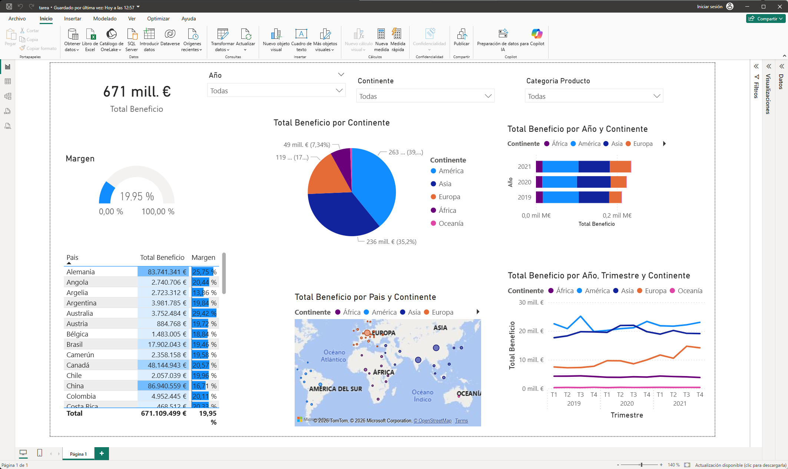

# 📊 Análisis de Beneficios Globales e Indicadores Financieros

### Descripción del Proyecto
Este proyecto consiste en un dashboard interactivo desarrollado en **Power BI** diseñado para monitorizar el rendimiento financiero global. Permite analizar la distribución de beneficios por continente, país y categoría de producto, facilitando la toma de decisiones estratégicas a nivel gerencial.

### 🛠️ Herramientas Utilizadas
* **Power BI Desktop:** Modelado de datos, creación de relaciones y visualización.
* **DAX:** Creación de medidas personalizadas para KPIs financieros (Margen, Total Beneficio).

### 📸 Vista Previa del Dashboard

*(Nota: La imagen se cargará correctamente si el archivo `dashboard_ventas.png` está subido a este repositorio).*

### 📈 Características Clave del Análisis
1. **KPIs Principales:** Monitorización en tiempo real del Total de Beneficios y el % de Margen de rentabilidad.
2. **Filtros Dinámicos:** Capacidad de segmentar la información por Año, Continente y Categoría de Producto.
3. **Análisis Geográfico:** Mapa interactivo y matriz de detalle para identificar los mercados más rentables (Ej: Alemania, China).
4. **Evolución Temporal:** Análisis de tendencias mediante gráficos de líneas que muestran el comportamiento de los beneficios trimestre a trimestre por continente.

### 📂 Cómo visualizar este proyecto
1. Descarga el archivo `tarea.pbix` incluido en este repositorio.
2. Ábrelo utilizando [Power BI Desktop](https://powerbi.microsoft.com/desktop/).
